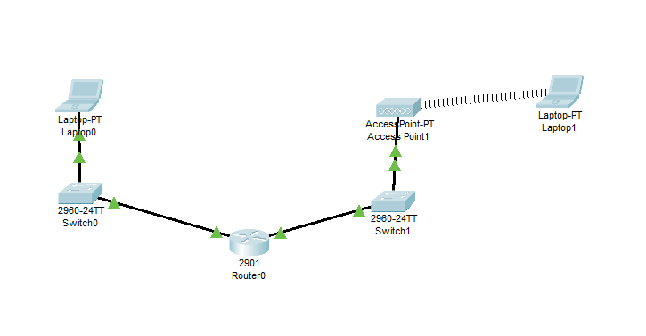

## Inhaltsverzeichnis

- [Aufgabe](#aufgabe)
- [Aufbau](#netzwerk-topologie)
- [Router](#Router)
  - [Router Config](#router-config)
- [Switch](#switch)
- [Wlan](#wlan)
- [Wireshark](#license)
- [All Commands](#commands)

## Aufgabe

Unsere Aufagabe der letzten Wochen war es ein Netzwerk aufzubauen, welches aus einem **Casio Router**, zwei **Switch**, einem **Wlan** bestand. Der Router wurde mit Switch 1 und **Switch 2** verbunden und der **Switch 2** mit dem **Wlan**. Wir mussten nur denn **Switch 1** und **Switch 2** die mit **f0/0** und **f0/1** verbunden waren IP Adressen vergeben da wir ebenfalls einen **DHCP funktion** einrichten mussten.

## Netzwerk Topologie



Casio Packet Tracer Datei: [Download](./KSN.pkt)

## Router
Der Router war ein Casio *NummerEinfügen* und hatte 2 Ports **f0/0** und **f0/1** diese haben wir mit **Switch 1** und **Switch 2** verbunden. Als nächstes haben wir **Switch 1** und **Swicth 2** ein **IP Adressen** und **Subnetz Masken** vergeben und zuguter letzt wurde die **DHCP funktion** eingerichtet.

### Connect Serial Port Putty
1. Download [Putty](https://www.chiark.greenend.org.uk/~sgtatham/putty/latest.html)
2. Select Serial Line to connect to your router
3. Click Open

### Router Config
**Wichtig alle befehle wurden in Putty Terminal einegege!!!**

#### Router Spesifikationen
1. auto setup **NO**
2. run `enable` to enter privileged mode
3. run `configure terminal` to enter global configuration mode
4. run `hostname R1` to set the hostname to R1

#### F0/0 Config (Sw1)
1. `interface f0/0` to enter interface configuration mode
2. `ip address 192.168.10.1 255.255.255.0` to set the IP address and subnet mask **Sw1**
3. `no shutdown` to enable the interface
4. `exit` to exit interface configuration mod

#### F0/1 Config (Sw2)
1.  `interface f0/1` to enter interface configuration mode
2. `ip address 192.168.20.1 255.255.255.0` to set the IP address and subnet mask **Sw2**
3. `no shutdown` to enable the interface
4. `exit` to exit interface configuration mod

### DHCP Config
Ein DHCP Server ist ein Server, der automatisch **IP-Adressen** und andere **Netzwerkinformationen** an Computer oder andere Geräte verteilt, die sich in einem **IP-Netzwerk** befinden. Der **DHCP-Server** auch **Dynamic Host Configuration Protocol (DHCP**) genannt ist ein wichtiger bestandteil in einem Netzwerk.

#### DHCP Config (SW1)
1. `interface f0/0` to enter interface configuration mode
1. `ip dhcp excluded-address 192.168.10.1` to exclude the IP address of the router
2. `ip dhcp included-address 192.168.10.2 192.168.10.100` to set the range of IP addresses that can be assigned by the DHCP server
3. `ip dhcp pool Sw1` to create a new DHCP pool
4. `network 192.168.10.0 255.255.255.0` to set the network and subnet mask
5. `default-router 192.168.1.1` to set the default gateway
6. `exit` to exit DHCP pool configuration mode
7. `show ip dhcp binding` to show the DHCP bindings

#### DHCP Config (SW2)
1. `interface f0/1` to enter interface configuration mode
1. `ip dhcp excluded-address 192.168.20.1` to exclude the IP address of the router
2. `ip dhcp included-address 192.168.20.2 192.168.20.100` to set the range of IP addresses that can be assigned by the DHCP server
3. `ip dhcp pool Sw1` to create a new DHCP pool
4. `network 192.168.20.0 255.255.255.0` to set the network and subnet mask
5. `default-router 192.168.1.1` to set the default gateway
6. `exit` to exit DHCP pool configuration mode
7. `show ip dhcp binding` to show the DHCP bindings

## Switch
Der Switch hatt die Nummer *NummerEinfügen* configuration war ser einfach da wir nur einen Namen vergeben mussten.

### Switch Config (Sw1)
1. `enable` to enter privileged mode
2. `configure terminal` to enter global configuration mode
3. `hostname Sw1` to set the hostname to Sw1
4. `exit` to exit global configuration mode
5. `show running-config` to show the running configuration

### Switch Config(Sw2)
1. `enable` to enter privileged mode
2. `configure terminal` to enter global configuration mode
3. `hostname Sw2` to set the hostname to Sw2
4. `exit` to exit global configuration mode
5. `show running-config` to show the running configuration

## Wlan
Das Wlan war ein **TP-Link** und hatte die Nummer *NummerEinfügen* und wurde mit **Sw2** verbunden.

## Wireshark
Wireshark ist ein freies Programm zur **Analyse von Netzwerkprotokollen**. Es ermöglicht das Aufzeichnen und**Anzeigen von Datenverkehr in einem Netzwerk** und soll damit zur **Lösung von Netzwerkproblemen beitragen**. Wireshark ist für die Betriebssysteme Windows, **Linux**, macOS, Solaris, FreeBSD, NetBSD und OpenBSD verfügbar.

### Wireshark Usage
Nun konnten wir unsere Laptops mit dem Wlan oder Sw1 oder Sw2 verbinden und mit Wireshark die Datenpakete analysieren.
1. Download [Wireshark](https://www.wireshark.org/download.html)
2. Select the interface you want to capture
3. Click Start

## All Commands
| Command | Description |
| --- | --- |
| `enable` | Enter privileged mode |
| `configure terminal` | Enter global configuration mode |
| `hostname R1` | Set the hostname to R1 |
| `interface` | Enter interface configuration mode |
| `ip address **IP** **Subnetz Mask**` | Set the IP address and subnet mask |
| `no shutdown` | Enable the interface |
| `exit` | Exit interface configuration mode |
| `ip dhcp excluded-address **IP**` | Exclude the IP address of the router |
| `ip dhcp included-address **IP** **IP**` | Set the range of IP addresses that can be assigned by the DHCP server |
| `ip dhcp pool **name**` | Create a new DHCP pool |
| `network **IP** **Subnetz Mask**` | Set the network and subnet mask |
| `default-router **IP**` | Set the default gateway |
| `exit` | Exit DHCP pool configuration mode |
| `show ip dhcp binding` | Show the DHCP bindings |
| `show running-config` | Show the running configuration |

### Command List for Copy & Paste
```bash
enable
configure terminal
hostname R1
interface f0/0
ip address
no shutdow
exit
interface f0/1
ip address
no shutdow
exit
ip dhcp excluded-address
ip dhcp included-address
ip dhcp pool
network
default-router
exit
show ip dhcp binding
show running-config
```

## All Config Modes
| Name| Mode | Description |
| --- | --- | --- |
| # | `enable` | Enter privileged mode |
| config | `configure terminal` | Enter global configuration mode |
| ip-config | `interface` | Enter interface configuration mode |
| dhcp-config | `ip dhcp pool **name**` | Create a new DHCP pool |

## Beteiligte Personen
- [MaximilinaWein](mailto:mwein@student.tgm.ac.at)
- [Rafi](mailto:mwein@student.tgm.ac.at)
